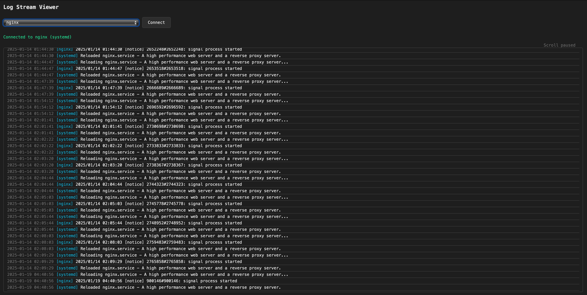

LogViewer was born out of the need to see some logs remotely.

This initial iteration is a bit messy, but it works well for my needs.

LogViewer streams predefined systemd daemons logs using journalctl, or logs from any active docker container.

1. `npm i` to install dependencies.
2. Copy `.env.example` -> `.env` and make changes. ALLOWED\_DAEMONS is a **comma separated** list of systemd daemons.
3. `npm run build` to build

4. Put it behind nginx. Instructions to follow..
